### <code>hamza@github ~ $ ./contributions.sh</code>

  

### <code>hamza@github ~ $ whoami</code>

<table>
  <tr>
    <td valign="top"></td>
    <td valign="top"></td>
  </tr>
</table>

 

Heatmap refreshes itself daily via GitHub Actions · all animation is pure SVG + CSS

